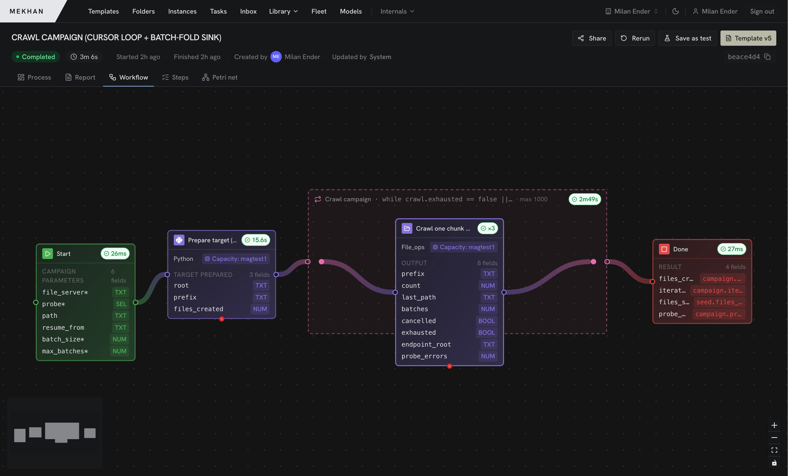

# Mekhan

*"Mekhan" is a working title — the platform's name may still change.*

**A unified control plane for real-world work.** Mekhan integrates the
infrastructure an organization already runs — people, HPC clusters, lab
instruments, workstations, edge devices, and AI model servers — into one system,
so a single workflow can **orchestrate** all of it, **observe** exactly what
happened, and **govern** it with end-to-end provenance.

Built for research and industry teams whose processes span people *and*
machines, and need to be durable, reproducible, and auditable.

> **⚠️ Early alpha — work in progress.** APIs, schemas, and the UI are changing
> fast; expect breaking changes between commits. Not production-ready — this is
> for early adopters and open development.

Mekhan turns a process into a **durable, executable graph** — workflows run on
an event-sourced engine that persists every step, so long-running work survives
crashes and spans people, HPC clusters, and lab hardware without losing state.



## What it does

- **Durable by default.** Execution state is event-sourced and persisted
  continuously, so long-running processes survive worker crashes, node
  preemption, network partitions, and control-plane restarts — they resume from
  the last completed step instead of starting over.
- **Advanced failure handling.** Per-step retry policies, explicit error ports
  that route to fallback / compensation branches, and finalizers that release
  held resources (a cluster allocation, a lab instrument) even when a run is
  torn down — so unpredictable environments don't strand work or leak capacity.
- **Author in an editor *or* from Git.** Build workflows in a real-time
  collaborative visual canvas (Svelte + [xyflow](https://github.com/xyflow/xyflow),
  Yjs co-editing), **or** author them as files and deploy with a rich CLI —
  `mekhan pull / diff / apply` is a GitOps flow that stamps git provenance on
  every version, and the file-first shape makes LLM-assisted workflow
  development and debugging natural.
- **Run heterogeneous work.** One graph mixes human tasks, automated steps
  (Python, containers, HTTP, SQL, ROS, …), and LLM / agent nodes across every
  execution target below — people, HPC clusters, worker pools, and edge runners.
- **Capture & manage data.** Built-in file-metadata extraction and a searchable,
  workspace-scoped **data catalogue** over pluggable storage — S3, GCS, Azure
  Blob, filesystem, SFTP, and more via [OpenDAL](https://opendal.apache.org) —
  so outputs become first-class, queryable data, not loose files.
- **Provenance & reproducibility.** Every run has an auditable causality trail
  you can inspect and replay — wired into the same event log that makes
  execution durable.
- **Multi-tenant, with SSO & 2FA.** Templates, runs, resources, data, and
  members are isolated per **workspace**, with role-based access (viewer /
  editor / admin / owner) and sharing; shared infrastructure (worker and runner
  groups, the model pool) lives in a global **platform** scope. Identity is
  delegated to **Zitadel** — OIDC single sign-on, **two-factor auth (2FA/MFA)**,
  and federation to any external provider (Google, Microsoft, GitHub, SAML,
  LDAP, …).

## Execution targets & feature highlights

One workflow can mix all of these — the platform is a single plane over them:

- **Human-in-the-loop & SOPs.** First-class human tasks with rich forms for data
  capture, structured reporting, and sign-offs — the building blocks of digital
  SOPs, with **operator pools** that route work to the right people by capability.
- **Datacenter scheduling.** Run steps on **Slurm and Nomad** clusters as
  first-class targets — with secure access handling (per-job, single-use secret
  tokens; credentials never live on the node), **container staging** (materialize
  an OCI image to an Apptainer `.sif` and run the executor inside it on HPC), and
  state reconciliation that detects drift between what the engine expects and the
  cluster's actual allocations.
- **Worker pools.** Pull-based, queue-fed pools of interchangeable workers for
  high-throughput, low-overhead jobs — the FaaS-style side of the platform. They
  run tasks (Python, containers, HTTP, …) without per-job scheduler overhead,
  ideal when you have many small units of work rather than a few large
  allocations.
- **Targeted runners.** Enroll a specific machine — a lab control computer, a
  workstation, an edge box — as a push-consumer runner with capability matching
  (similar in spirit to GitLab runners). The simplest path for most small setups.
- **Capacity pools.** Model any contended, counted resource as a capacity pool —
  concurrency limits, instrument time, or **third-party floating licenses** — so
  the engine only dispatches work when a slot is genuinely free and releases it
  (even on failure) when the work is done.
- **Local LLM serving.** A self-hosted, **vLLM- or Ollama-backed** model pool
  behind an industry-standard, **OpenAI-compatible** serving API: model
  **autoscaling and eviction**, load balancing across replicas, admission
  control, usage metering, and model lifecycle management — so `llm` and agent
  steps run against your own infrastructure.

## Quick start

The fastest path to a running full stack (infra + engine + executor + control
plane + frontend) is the `just` recipe — it wires up Postgres, NATS, S3, Vault,
and seeds the demo workflows for you:

```bash
just dev                          # full stack up (see `just` for all recipes)
# → frontend  http://localhost:15173
# → API       http://localhost:13100
just dev down                     # stop everything
```

> **▶ First run:** the initial `just dev` compiles the whole Rust workspace and
> frontend from source — expect several minutes on a cold cache; later runs are
> fast. Once it's up, open the frontend (you're auto-signed-in as a dev admin),
> open the **Demos** folder, and run **`01-hello-world`** — then walk the
> numbered `01 → 06` learning path, which covers every editor primitive. See
> [`demos/README.md`](./demos/README.md) for the full catalogue.

Or run the pieces by hand:

```bash
docker compose up -d              # Postgres + NATS
cd service && cargo run           # backend
cd app && pnpm install && pnpm dev   # frontend (separate terminal)
```

Native build deps (HDF5, NetCDF, protobuf, etc.) and per-OS install one-liners
are in [`docs/setup.md`](./docs/setup.md). Nix users: `nix develop` gives you
everything.

## CLI & tools

Alongside the server components, the monorepo ships command-line tools. Build any
of them with `cargo build`, or `cargo install --path …` to put them on your PATH:

- **`mekhan`** — the GitOps CLI for workflows: author them as files, then
  `pull` / `diff` / `apply` against a running control plane, plus `run`,
  `status`, and `logs`.

  ```bash
  cargo install --path service --bin mekhan        # from the repo root
  mekhan --server http://localhost:13100 status    # talk to a running stack
  ```

- **`mekhan-runner`** — the task executor daemon that performs the work. `just
  dev` runs one for you; to build/run a standalone runner against your own NATS,
  see [`executor/README.md`](./executor/README.md):

  ```bash
  cargo install --path executor/crates/executor-service   # installs `mekhan-runner`
  mekhan-runner                                            # config via executor.toml / EXECUTOR_* env
  ```

- **`mekhan-debug`** *(advanced)* — a low-level CLI for inspecting net/engine
  internals (`status`, `state <net>`, `events`, `trace`). Most users never need
  it.

  ```bash
  cargo install --path engine/cli                          # installs `mekhan-debug`
  ```

## What's here

| Directory | What it is |
|-----------|-----------|
| [`engine/`](./engine/) | Durable, event-sourced workflow execution engine, SDK, CLI, simulator — NATS-streamed, with Slurm/Nomad bridges (Apache-2.0) |
| [`executor/`](./executor/) | Distributed task executor — Python / Docker / HTTP / LLM / ROS / … backends (Apache-2.0) |
| [`service/`](./service/) | Control plane / BFF — Axum + Postgres + NATS + Yjs; the workflow compiler, catalogue, collaboration server, and the `mekhan` GitOps CLI (FSL-1.1-ALv2) |
| [`app/`](./app/) | SvelteKit frontend — Svelte 5, xyflow canvas, Yjs collaborative editing (FSL-1.1-ALv2) |
| [`shared/`](./shared/) | Vendored `apalis` fork, file-metadata extraction, secrets plumbing |
| [`demos/`](./demos/) | 80+ runnable demo workflows, seeded automatically by `just dev` |
| [`docs/`](./docs/) | Architecture & design notes — start at [`docs/README.md`](./docs/README.md) |

## Moving parts

- **Control plane — `mekhan` (`service/`).** Authors, compiles, versions, and
  governs workflows; owns tenancy, the data catalogue, and the real-time
  collaboration server. Its HTTP API is OpenAPI-described.
- **Engine (`engine/`).** A colored-Petri-net, event-sourced execution core:
  runs the net, journals every step (so runs are durable and replayable), and
  bridges out to schedulers and runners.
- **Executors (`executor/`).** The workers that actually perform the steps —
  assembled from pluggable backends (Python, containers, HTTP, LLM, …) and
  configured per deployment.
- **Frontend (`app/`).** A single-page app — the visual workflow editor and
  operator surfaces — generated against the control plane's OpenAPI contract.
- **Integrations.** Schedulers, object storage, model servers, lab runners, and
  external triggers/webhooks, each plugged in per deployment.

Backend services are written in **Rust** and expose **OpenAPI** specs; the
frontend is **Svelte / SvelteKit**. For the full architecture and how the pieces
fit together, see [`docs/README.md`](./docs/README.md).

**Backing services** (all wired up for you by `just dev`):

- **PostgreSQL** — control-plane state
- **NATS / JetStream** — event and job streaming
- **Object store** — artifacts (S3 / GCS / Azure / filesystem via OpenDAL)
- **Vault** — secrets

Optional per deployment:

- **Zitadel** — identity & access: OIDC single sign-on, two-factor auth
  (2FA/MFA), and federation to external providers. Dev defaults to an offline
  no-op auth; `just dev up-auth` switches to real Zitadel-backed login.
- **Nomad** or **Slurm** — HPC scheduling
- **Ollama** or **vLLM** — LLM serving
- **Docker** — container steps

## Project background

~1 year of active development, building on platforms [Aithericon](https://aithericon.eu)
has designed and operated in commercial and academic settings for 6+ years.

**How it's built:** much of the code is LLM-written. We treat that as an
engineering practice with rigor to match — every subsystem is backed by
extensive test harnesses and validation suites, alongside comprehensive manual
testing.

## ⚠️ Security & maturity

This is an **early alpha** shared for open development. Read before deploying:

- **Configure before exposing.** The default `just dev` / `docker compose` stack
  uses throwaway dev credentials so it runs offline in one command — **don't
  expose it or put real data in it without proper configuration.** Production
  hardening (real auth, secret management, TLS, tenancy isolation) is in active
  development.
- **No security guarantees yet.** Treat self-hosted instances as experimental.
- **Reporting a vulnerability:** please see [`SECURITY.md`](./SECURITY.md).
  Do not open public issues for security problems.

## Licensing

Multi-licensed per crate. The **engine & SDK are open source (Apache-2.0)**; the
**control plane is source-available (FSL-1.1-ALv2)**. In practice the FSL lets
anyone use, modify, and self-host the platform freely — internal, research, or
commercial use all included — and only prohibits using it to offer a competing
commercial product or managed/hosted service. Each release also converts to
Apache-2.0 two years later. See [`LICENSING.md`](./LICENSING.md) for the
per-crate table and the rationale.

## Contributing

See [`CONTRIBUTING.md`](./CONTRIBUTING.md). Contributions go in under
inbound=outbound license with a DCO sign-off (`git commit -s`).
